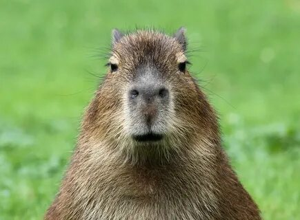

# игструкция для работы с Markdowm

## выделение текста

чтобы выделить текст курсивом необходимо обрамить его звёздочкой(*) или знаком нижнего подчёркивания(\_). Например вот так *bum bum\* или _вот так_

чтобы выделить текст полужирным,необходимо обрамить его двойными звёздочками(**) или выделить двойным знаком нижнего подчёркивания( \_\_ ) ,например , **тип так** , или **вот так\*\*

Альтернативные способы выделения текста жирным или курсивным,чтобы мы могли совмещать оба этих способа.Например _текст может быть выделен курсивом и при этом быть **полужирным**_

## списки

## Работа с изображениями

Чтобы вставить изображение в текст,достаточно написать следующее:

Чтобы добавить ненумерованные списки,необходимо пункты выделить звёздочкой(\*)или знваком + ,например вот так:

- Элумент 1
- Элемент 2
- Элемент 3

* элемент 4

Чтобы добавит нумерованные списки,необходимо пунуты промумеровать,например вот так:

1. ПЕрвый пункт
2. Второй пункт

## Работа с изобрадениями

## Ссылки

Чтобы выделить ненумерованный список используем (\*)

## Работа с таблицами

## Цитаты

## заключение
